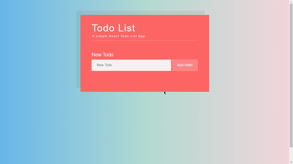

<h1 align="center">To-do list React Application</h1>
<h4 align="center">
   
</h4>

  <a href="#wrench-built-with">Built With</a>&nbsp;&nbsp;&nbsp;|&nbsp;&nbsp;&nbsp;
  <a href="#-about">About</a>&nbsp;&nbsp;&nbsp;|&nbsp;&nbsp;&nbsp;
  <a href="#electric_plug-how-to-set-up">How to Set Up</a>&nbsp;&nbsp;&nbsp;|&nbsp;&nbsp;&nbsp;
  <a href="#-how-to-contribute">How to Contribute</a>&nbsp;&nbsp;&nbsp;|&nbsp;&nbsp;&nbsp;
  <a href="#pencil-author">Author</a>

## :wrench: Built With

- [React](https://reactjs.org)

## 💻 About

At their most basic, to-dos contain all of the tasks that you need to complete on a given day. It’s a great place for managing time that enables you to lay out everything that you need to accomplish and plan and prioritize your day from there. You can also make to-dos for major tasks like a work assignment or an overall goal. Therefore, the overall purpose of creating a to-do is to remember tasks and create a plan of action to accomplish them.

## :electric_plug: How to Set Up

- Clone the project: `git clone https://github.com/Lukazovic/todo-react-app.git`;
- Go to the project folder: `cd todo-react-app`;
- Download the dependencies: `npm install`;
- Start the application: `npm start`.

It will open a browser page (if it doesn't, go to [http://localhost:3000](http://localhost:3000/)).

## 🤔 How to Contribute

- Fork this repository;
- Create your branch with your feature: `git checkout -b my-feature`;
- Commit your feature: `git commit -m 'feat: My new feature'`;
- Push to your branch: `git push origin my-feature`.

Then merge your pull request, you can now delete your branch

## :pencil: Author

<table>
  <tr>
    <td align="center"><a href="https://github.com/Lukazovic"> <b>Lucas Vieira</b></a> </td>
  <tr>
</table>
